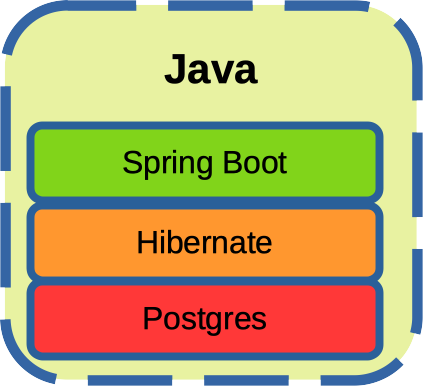

#### Telemetry Collector Server (Java)

It is one of the three applications on which will be carried out performance tests in order to determine which are the most performing technologies. This is the Java version. 

<p align="center" width="100%">
     
</p>
Technology stack: Java, Spring Boot, Hibernate, Postgres

See also:

- [oh_telemetry_collector_load_test](https://github.com/goto-eof/oh_telemetry_collector_load_test)
- [oh_telemetry_collector_server_java](https://github.com/goto-eof/oh_telemetry_collector_server_java)
- [oh_telemetry_collector_server_rust](https://github.com/goto-eof/oh_telemetry_collector_server_rust)
- [oh_telemetry_collector_server_ts](https://github.com/goto-eof/oh_telemetry_collector_server_ts)

### Run 

```bash
docker-compose up
```

### Run only DBMS

```bash
docker-compose -f docker-compose-dbms.yml up
```

### Use postman collection for making requests

Import postman.json

### The server responds on

```
http://localhost:8013/collect
```


### DB connection

```
postgres://127.0.0.1:5433/postgres
username: postgres
password: postgres
```
